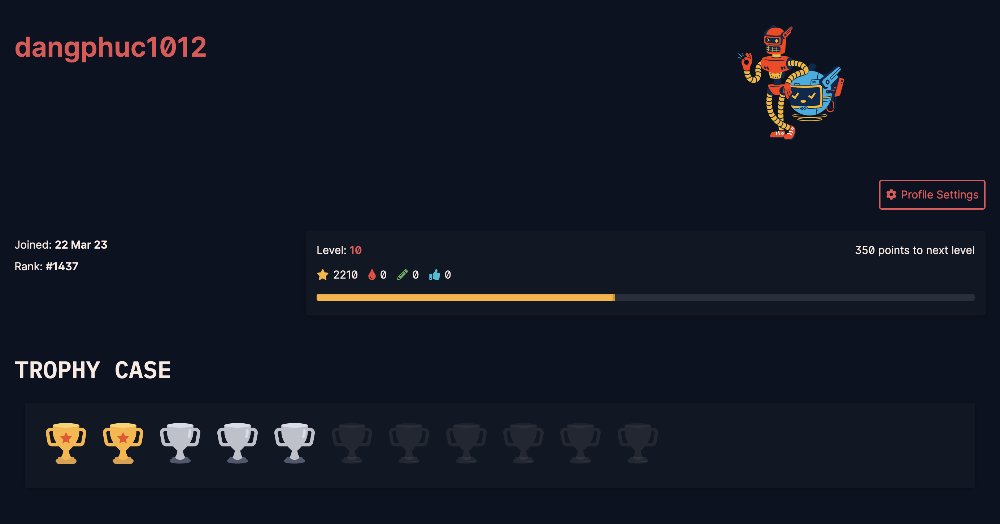

# 💫 About Me:
* ✋ Hi, My name is Dang Nguyen Phuc.
* 📖 I am currently studying at HCMUT in Vietnam (Junior).
* 🌸 I'm interested in Cryptography and IoT things.

# 🔐 Hacking
## Cryptohack: 
[My Cryptohack profile](https://cryptohack.org/user/dangphuc1012/)

## [pwn.college](https://dojo.pwn.college): 
    * My pwn.college username: 2012968-dangnp, 
    * My pwn.college userID: 4572

# 📊 GitHub Stats:
<!--   -->
 
<!--  -->

## 🏆 GitHub Trophies

### 🔝 Top Contributed Repo

# 💻 Tech Stack:
                  

## 🌐 Socials:
   

